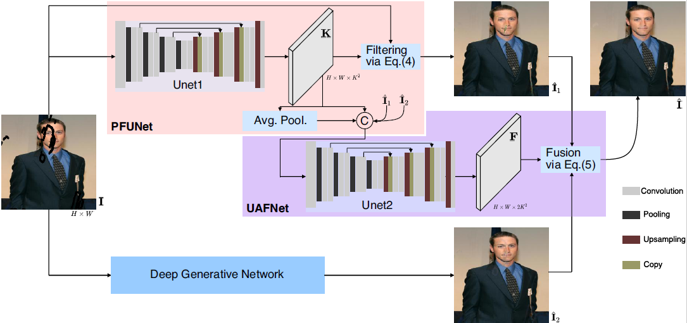

# JPGNet: Joint Predictive Filtering and Generative Network for Image Inpainting
We propose a new method for image inpainting by formulating it as a mix of two problems that predictive filtering and deep generation. Please refer to the paper for details: https://arxiv.org/pdf/2107.04281.pdf



## Dataset

- Places2 [Data of Places365-Standard](http://places2.csail.mit.edu/download.html)
- CelebA(https://mmlab.ie.cuhk.edu.hk/projects/CelebA.html)
- Dunhuang
- Mask (https://nv-adlr.github.io/publication/partialconv-inpainting)

1. For data folder path (CelebA) organize them as following:

```shell
--CelebA
   --train
	  --1-1.png
   --valid
      --1-1.png
   --test
      --1-1.png
   --mask-train
	  --1-1.png
   --mask-valid
      --1-1.png
   --mask-test
	  --0%-20%
	     --1-1.png
	  --20%-40%
	     --1-1.png
	  --40%-60%
	     --1-1.png
 ```
 
 2. Run the code  `./data/data_list.py` to generate the data list


## Pretrained models

We release our pretrained model (CelebA) at [models](https://drive.google.com/)

pretrained model (Places2) at [models](https://drive.google.com/)

pretrained model (Dunhuang) at [models](https://drive.google.com/)

## Train

python train.py
For the parameters: checkpoints/config.yml, kpn/config.py

## Test

python test.py
For the parameters: checkpoints/config.yml, kpn/config.py

## Results

- Comparsion with SOTA, see paper for details.


- Penumbra comparsion between ours and SP+M Net


- Testing result


**More details are coming soon**

## Bibtex

```
@article{guo2021jpgnet,
  title={JPGNet: Joint Predictive Filtering and Generative Network for Image Inpainting},
  author={Guo, Qing and Li, Xiaoguang and Juefei-Xu, Felix and Yu, Hongkai and Liu, Yang and others},
  journal={arXiv e-prints},
  pages={arXiv--2107},
  year={2021}
}
```

# Acknowledgments
Parts of this code were derived from:<br>
https://github.com/tsingqguo/efficientderain <br>
https://github.com/knazeri/edge-connect <br>
https://github.com/RenYurui/StructureFlow<br>
https://github.com/jingyuanli001/RFR-Inpainting<br>
